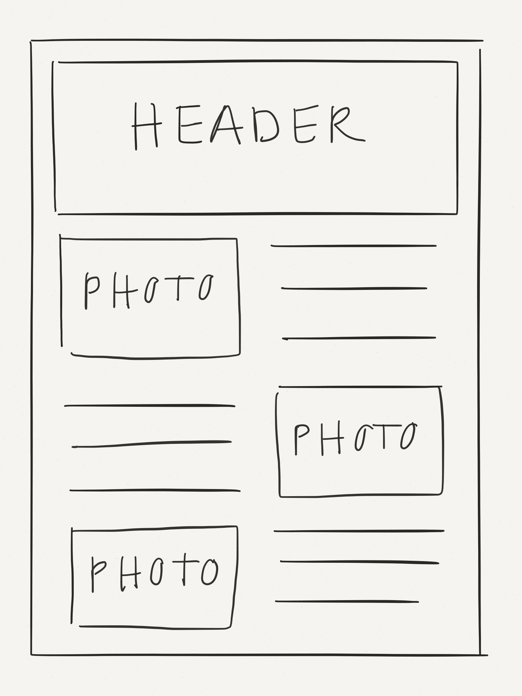
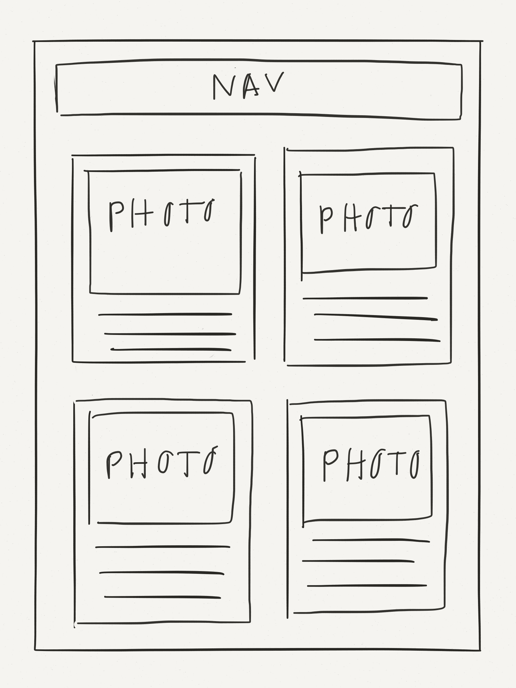
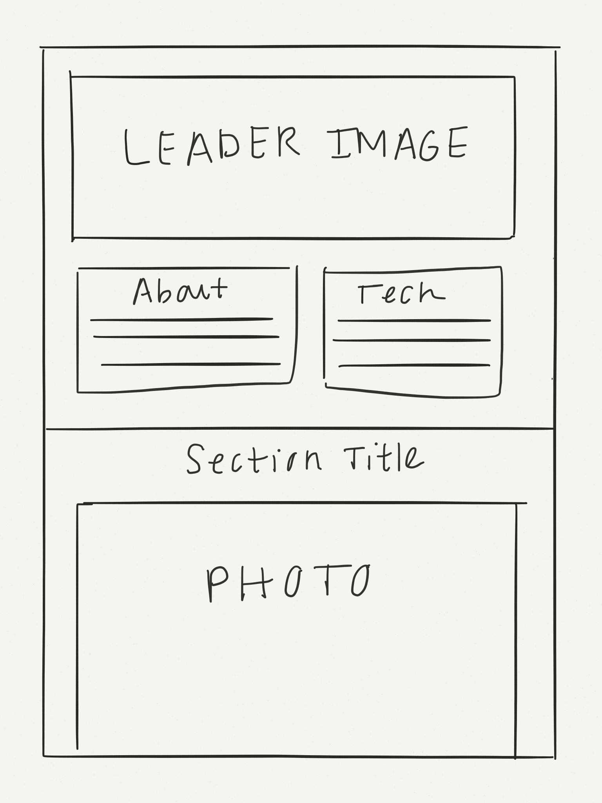

# Portfolio Lab

  You're going to need a portfolio site to showcase the amazing projects you'll build in WDI. Your task is to create the "projects" page of your portfolio site using [Bootstrap](http://getbootstrap.com/css) and one of the common portfolio layouts in the **Wireframes** section below.

  Feel free to put in placeholder images and text for now. [Placeit](https://placeit.net), [Placehold.it](http://placehold.it), and [Hipster Ipsum](http://hipsum.co) are great resources.

## Requirements
  1. Create a new GitHub repo for your portfolio.
  2. Start with an `index.html` for your portfolio's "projects" page (you can use this [Bootstrap boilerplate](https://github.com/sf-wdi-19-20/modules/tree/master/w1_d2_2_bootstrap_css/bootstrap_boilerplate) to help you get started).
  3. Choose one of the **Wireframes** below to implement with HTML, CSS, and Bootstrap.
  4. Use the [Bootstrap grid system](http://getbootstrap.com/css/#grid) to make your page responsive.
  5. Use at least one [Bootstrap component](http://getbootstrap.com/components) on your page (like a [nav](http://getbootstrap.com/components/#nav), [jumbotron](http://getbootstrap.com/components/#jumbotron), or [thumbnails](http://getbootstrap.com/components/#thumbnails-custom-content)).
  6. Submit the link to your GitHub repo in the [homework submission form](https://docs.google.com/a/generalassemb.ly/forms/d/14rNXnDaq5X5Rvda-1BRZCl9YmkOoZzf7oxGBEZG_YJE/viewform).

## Wireframes

#### Alternating Photo/Description
  [[inspiration]](http://www.randallleung.com)

  

#### Project Cards
  [[inspiration]](http://www.nicolastarier.com)

  

#### Case Study
  The "case study" layout is meant to represent a detailed page for one project. [[inspiration]](http://haraldurthorleifsson.com/googleplus)

  

## Bonus
  1. Add one or more design elements from [Bootsnipp](http://bootsnipp.com) ([social icons](http://bootsnipp.com/snippets/featured/spinning-social-icons) are always a good choice :+1:).
  2. Customize your portfolio by overriding some of Bootstrap's defaults with your own CSS styles.
    * **Hint:** You will need to link to a `style.css` in your `index.html` (make sure it comes after your link to the Bootstrap CDN).
    * A simple way customize Boostrap is to use a [Google Font](https://www.google.com/fonts).
  3. In addition to your "projects" page, create an "about" and/or "contact" page.

## Resources

#### Bootstrap
  * [Bootstrap Docs](http://getbootstrap.com/css)
  * [Bootsnipp](http://bootsnipp.com)

#### Design Inspiration
  * [UI Parade](http://www.uiparade.com)
  * [Dribble](https://dribbble.com)
  * [AWWWARDS](http://www.awwwards.com/websites/portfolio)

#### Fonts, Icons, Colors
  * [Google Fonts](https://www.google.com/fonts)
  * [Font Awesome (Icons)](http://fortawesome.github.io/Font-Awesome/icons)
  * [The Noun Project](https://thenounproject.com)
  * [Adobe Kuler](https://color.adobe.com/explore/newest)
  * [Flat UI Color Picker](http://www.flatuicolorpicker.com)
  * [Sip (Color Picker)](https://itunes.apple.com/us/app/sip/id507257563)
