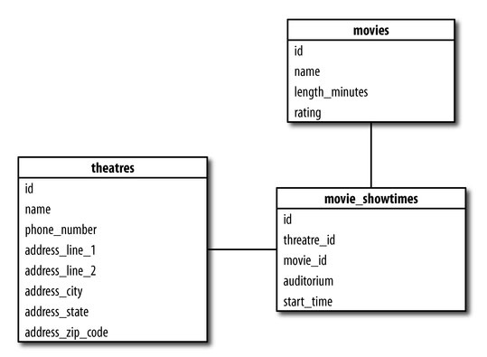

#Title

| Objectives |
| :--- |
| Use User Stories, Schema Drawings, and Kandan Boards to plan development projects  |

| Concepts | Tools | Activities |
| :---: | :---: | :---: |
| Agile Development (not Waterfall!) | User Stories, Schema Drawings, Kanban Board | Plan Project 0 |

### Motivation (Why?)

There is a lot to do in web development? Where do you start? What steps do you take first?

These tools are the industry standard for web development and software engineering at all levels from the smallest startup to Airbnb.

### Analogy (What?)

Putting on your pants while in the shower.

Putting a baby on a bicycle.

### Key Take Aways & Key Snippets

#### User Narratives - Example from Coride.com

> Hi I'm Dan the Driver, I'm driving from Madison to Chicago, so I put in my trip with a total price of $20 and a pickup point of 2 o'clock at the dutch mill park and ride. I immediately see that there are some people I could pick up in Madison and some in Janesville. I contact the people from Madison first because I'd get the whole fair that way. if they don't work out I'll contact the Janesville people.

#### Schema Drawing

#### Waterfall vs. Agile Development

##### Waterfall Development (DONT DO THIS)

##### Agile (DO THIS)

#### Kanban Board

#Challenges

### Basic Challenges

1. Write 3 user stories (50 words each max) for an imaginary app called "spacebook.com" where aliens and astronauts can make friends. make status posts, and plan space soirees. How many "development stories" would these break down into?
2. Draw a basic schema drawing for spacebook's major objects.
3. Write out a release schedule of spacebook. What stories would be part of your walking skeleton for your first push to production? Which stories would be your MVP? What about your 1.0? 2.0?
4. Make a Kanban Board for your stories with paper and sticky notes.

### Stretch Challenges

1. Start [Project 0](https://github.com/sf-wdi-19-20/modules/tree/master/w2_d4_3_project_0) : )
