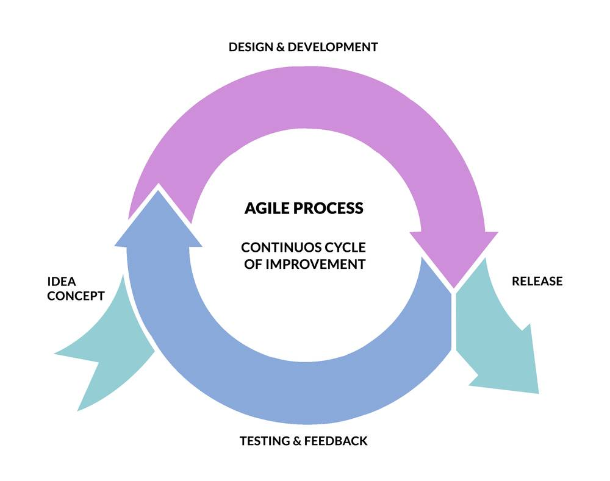
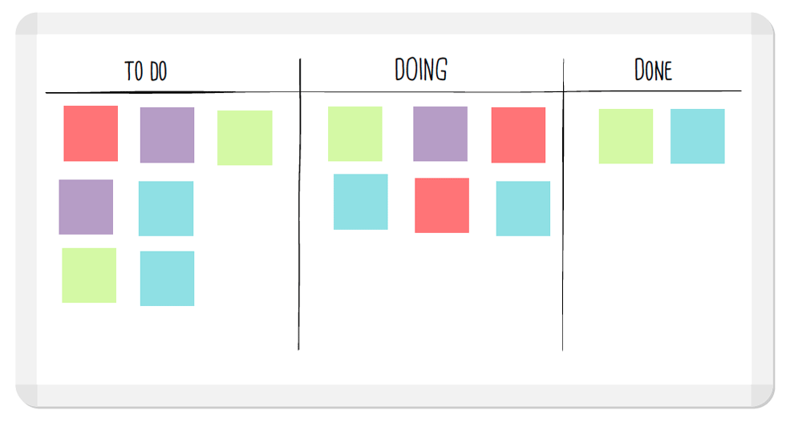

#Title

| Objectives |
| :--- |
| Use User Stories, Schema Drawings, and Kandan Boards to plan development projects  |

| Concepts | Tools | Activities |
| :---: | :---: | :---: |
| Agile Development (not Waterfall!) | User Stories, Schema Drawings, Kanban Board | Plan Project 0 |

### Motivation (Why?)

There is a lot to do in web development? Where do you start? What steps do you take first?

### Analogy (What?)

### Key Take Aways & Key Snippets

#### User Narratives - Example from Coride.com

> Hi I'm Dan the Driver, I'm driving from Madison to Chicago, so I put in my trip with a total price of $20 and a pickup point of 2 o'clock at the dutch mill park and ride. I immediately see that there are some people I could pick up in Madison and some in Janesville. I contact the people from Madison first because I'd get the whole fair that way. if they don't work out I'll contact the Janesville people.

#### Schema Drawing

#### Waterfall vs. Agile Development

##### Waterfall Development (DONT DO THIS)

##### Agile (DO THIS)

#### Kanban Board

#Challenges

### Docs & Resources

### Basic Challenges

### Stretch Challenges
