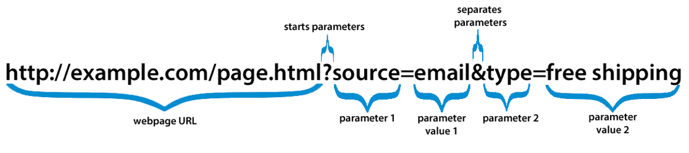
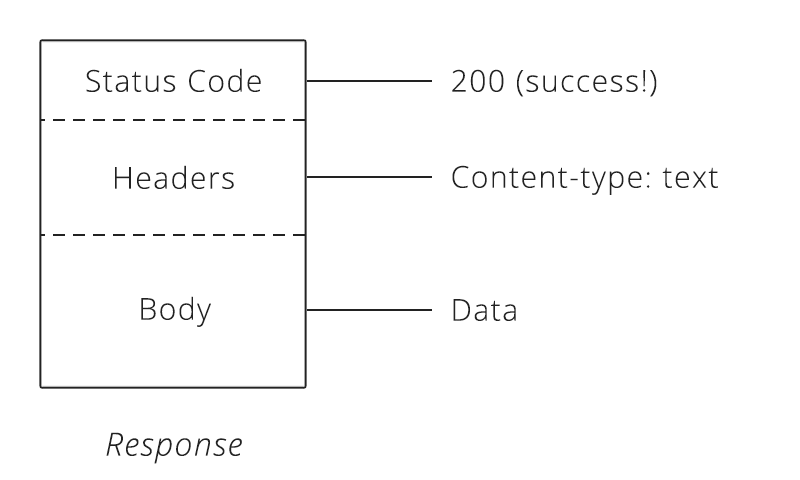

# Exploring APIs

| Objectives |
| :--- |
| Explore and make queries on open APIs |

| Concepts | Tools | Activities |
| :---: | :---: | :---: |
| APIs, HTTP, RESTful Routes  | Postman | Challenges |

### Motivation (Why?)

APIs are the URL conventions for accessing web servers.

### Analogy (What?)

APIs are like a robot that needs special commands to have it do things. If you say the right commands, then it behaves, if you don't then the robot doesn't understand.

### Key Snippets & Concepts

#### How to Interact with APIs

1. `$ curl` in the terminal
```
$ curl -i "https://api.spotify.com/v1/artists/3jOstUTkEu2JkjvRdBA5Gu"
```
2. RESTful API Explorer App - Postman
```
https://api.spotify.com/v1/artists/3jOstUTkEu2JkjvRdBA5Gu
```
3. jQuery AJAX
```
$.get("https://api.spotify.com/v1/artists/3jOstUTkEu2JkjvRdBA5Gu", function(data) {
  console.log(data);
  var artist = data
});
```

#### RESTful Routing

Routing Based on Resources - "RESTful Routing"

```
Query     GET           v1/artists
Show      GET           v1/artists/:id
Create    POST          v1/artists/:id
Update    PUT/PATCH     v1/artists/:id(.:format)
```

#### Structure of a URL Request



Example Spotify API artist lookup by ID
```
https://api.spotify.com/v1/artists/3jOstUTkEu2JkjvRdBA5Gu
```

Example Spotify API artist search
```
https://api.spotify.com/v1/search?type=artist&q=weezer
```

#### Structure of a Reponse



Basic HTTP Response Statuses

| Number | Status |
| :----: | :----- |
| 200 | Success |
| 400 | Bad Request |
| 401 | Unauthorized |
| 403 | Forbidden |
| 404 | Not Found |
| 500 | Internal Server Error |
| 503 | Service Unavailable |

#Challenges

### Docs & Resources

1. [Spotify API Endpoint Reference](https://developer.spotify.com/web-api/endpoint-reference/)
2. [Gify API](https://api.giphy.com/)

Remember to include the api_key parameter with every request:
```
http://api.giphy.com/v1/gifs/search?q=funny+cat&api_key=dc6zaTOxFJmzC
```

### Basic Challenges

1. Use Postman to search the Spotify API for the artist "Weezer" - What is their artist_id?
2. Use the Weezer artist_id to query for them directly.
3. Search the Spotify API for song "(Oh Lord Won't You Buy Me A) Mercedes Benz" sung by Joan Baez.
> Hint: remember blank spaces need to be replaced with `%20` to make it 'url safe'

4. Make one request to the Spotify API to search for an album or artist called "Clouds".
5. Search the Spotify API for "(Oh Lord Won't You Buy Me A) Mercedes Benz" sung by Joan Baez. Can you get this to be the top response?
> Hint: By default, results are returned when a match is found in any field of the target object type. Searches can be made more specific by specifying an album, artist or track field filter. For example, the query q=album:gold+artist:abba&type=album will only return albums with the text "gold" in the album name and the text "abba" in the artist's name.

### Stretch Challenges

1. Make a query that returns gifs trending on gify.com.
2. Make a query that returns a random gif on gify.com
3. Use Postman to search the gify api for funny gifs. Post some to #Funnybiz on slack. (Don't forget to use the public api_key parameter "api_key=dc6zaTOxFJmzC")
