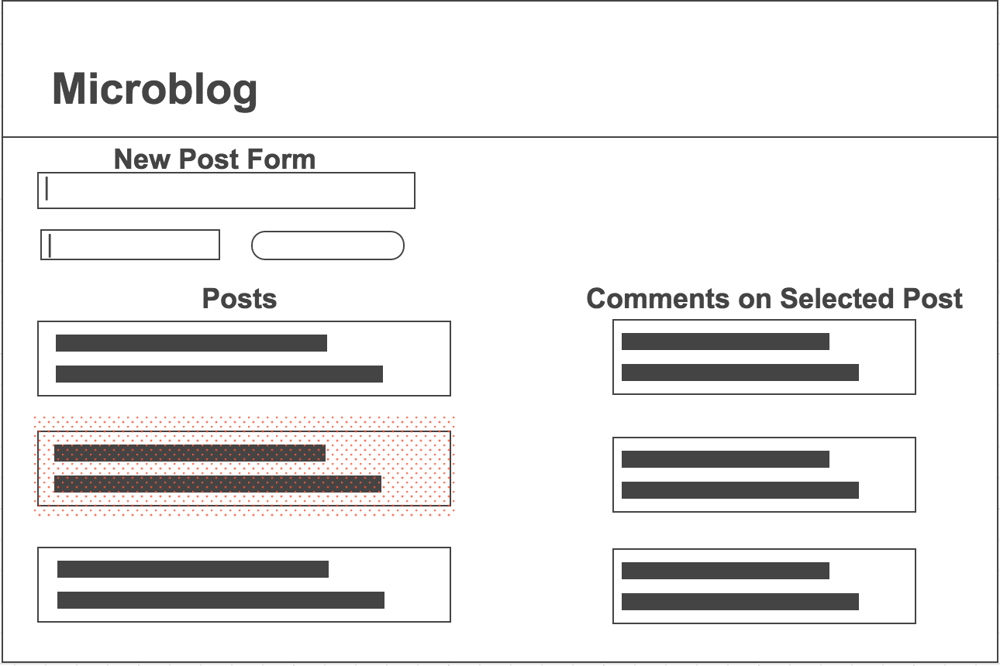

# Mongoose Relationships Lab

**Objective:** Add embedded comment data and referenced author data to your microblog project.

Each post "has one" author and "has many" comments.

## Basic Challenges

### Models

**Goal: set up or update schema and models in models file**

1. Create a schema and a model for Comment data. The Comment schema should include at least the text of the comment.

1. Create a schema and a model for Author data. The Author schema should include at least the name of the author.

1. Update the Post schema to include a list of embedded Comments.

1. Update the Post schema to include a reference to one Author. If you have an author attribute, replace it.

**File connection hints:**

 * In the solutions, we add all of the schemas and models to one file and rename it from `post.js` to `models.js`.
 
 * We then update the export line to say `module.exports.Post = Post;`. (We also add a few export lines.)
 
 * In the server code, we create a variable called `db` to hold all of the model module exports:
   
   ```js
   var db = require('./models/models');
   ```
   
   This replaces where we directly required './models/posts' and created a `Post` variable.
 
 * In the server code, we now access all of our models as attributes of `db`. Here's an example:

   ```js
   db.Post.find(function(err, posts){
      console.log(posts);
   });
   ```

### Server Code

**Goal: update old routes to accommodate new author format**

1. Update your route to get all blog posts, `GET /api/posts`. When the server receives a request at this route, it should:
 
 * find all of the posts from the database
 
 * populate all of the post's author information
 
 * send back all the posts as the JSON response
 
1. Update your route to create a new blog post,  `POST /api/posts`. When the server receives a request at this route, it should:

  * create and save a new author record
  
  * create a new post
  
  * save the new author record's _id as the new post's author
  
  * save the new post
  
  * send the new post as the JSON response

**Goal: add basic routes for making and reading embedded comments**

1. Make a route to read the comments on one blog post: `GET /api/posts/:postid/comments`. When the server receives a request at this route, it should:

  * query the database to find the post indicated by the id

  * send the post's comments as the JSON response

1. Make a route to create a new comment on a blog post: `POST /api/posts/:postid/comments`.  When the server receives a request at this route, it should:

  * query the database to find the post indicated by the id

  * create a new comment record

  * add the new comment to the post's list of embedded comments
  
  * save the changes to the post

  * send the new comment as the JSON response

**Goal: add basic routes for referenced authors**

1. Make a route to get all authors: `GET /api/authors`. When the server receives a request at this route, it should:

  * query the database to find all authors

  * send the authors as the JSON response

1. Make a route to create a new author: `POST /api/authors`. When the server receives a request at this route, it should:

  * make a new author

  * save the new author in the database

  * send the new author as the JSON response


1. Make a route to assign a specific author to a specific post: `PUT /api/posts/:postid/authors/:authorid`. When the server receives a request at this route, it should:

  * query the database to find the author (to make sure the id actually matches an author)

  * query the database to find the post

  * update the post to reference the author
  
  * save the updated post

  * send the updated post as the JSON response


###Stretch Challenges: Server Code


1. Make a route to update a single comment: `PUT /api/posts/:postid/comments/:commentid`.  When the server receives a request at this route, it should:

  * query the database to find the comment indicated by the id

  * update the comment

  * save the comment

  * send the updated comment as a JSON response

1. Make a route to delete a single comment: `DELETE /api/posts/:postid/comments/:commentid`.  When the server receives a request at this route, it should:

  * query the database to find and the post indicated by the id

  * remove the specified comment from the post's list of embedded Comments

  * query the database to find and remove the comment

  * send the deleted comment as the JSON response (or send a status 200 - your choice)

### Stretch Challenges: Client-Side Code

**Goal: update old requests to accommodate new author format**

When the server sends back post data, the post objects now look like this:

```js
{
    "_id": "55a5835042964888612bc16f",
    "author": {
        "_id": "55a5835042964888612bc16e",
        "name": "Oscar Wilde",
        "__v": 0
    },
    "text": "I can resist everything except temptation.",
    "__v": 0,
    "comments": []
}
```

We'll need to update the client side code to account for the new format of author -- it's not a string any more; it's an object.  In particular, wherever `author` appears in our template, we'll need to change that to use the author's name.
 

**Goal: Update your view to show all the comments on a post when the post is clicked.**

1. Set up a place in your `index.html` to display comments.
Hint: How about a new column off to one side that shows all the comments for the last clicked post?

    

1. Add a click event listener to tell when a post is clicked. Hint: check out the delete button click event listeners in one of the sample projects.

1. Update your click event listener to include an AJAX call to `GET` all the comments for the blog post from your API when a post is clicked.

1. Use jQuery and Underscore templating to render the comments in the view.

Note: You may notice some bugs (for example, comments don't disappear when you delete their post). Don't worry about them for now.

**Goal: display a new comment form when the post is clicked.**

1. Set up a place in your `index.html` to display the new comment form. Hint: How about over in the comments div?

1. Update your post click event listener to use jQuery and Underscore templating to render the form in the view.

1. Add a jQuery submit event handler on the form.

1. Update your new comment form event handler to `POST` the data to your API. Hint: which route creates a new comment for a post?


## Readings and Submission

###Evening Reading

Read Salted [Password Hashing - Doing it Right](https://crackstation.net/hashing-security.htm), sections: "What is password hashing?", "How Hashes are Cracked", "Adding Salt".

###Submission

Submit the link for your microblog repo on github, along with any comments, in [the HW form](https://docs.google.com/a/generalassemb.ly/forms/d/14rNXnDaq5X5Rvda-1BRZCl9YmkOoZzf7oxGBEZG_YJE/viewform).
