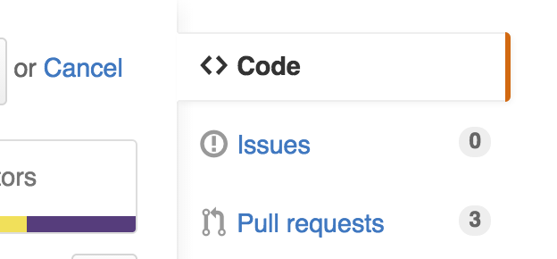

# Pull Request Project

## Basic Challenge

1. **10 min** - Go to your project 1 Github and add 1 issue to your project. Make it a simple issue, like a small addition, that could be solved relatively quickly with the tools we already have - jQuery, express, etc. Be descriptive of what is wrong and how you'd like it fixed. Maybe give some rough steps you'd take to solve it.
<div style='width:300px;'></div>
2. **2 min** Next, pair up (A & B)
3. **3 min** Find another pair (so you're in groups of 4) (A & B + C & D)  
> C & D follow the same instructions as for A & B  
4. **10 min** Now, A & B, read the issue that C added to their project.
5. **5 min** Fork C's project, clone your forked repo to your computer to create your local copy, and fire up the fork.
<div width="300px"></div>
```
$ git clone <<your fork url>> <<new project name (optional)>>
```
6. **1 min** Make a new branch named after the issue you're solving.
```
$ git checkout -b adding_comments
```
7. A & B, pair to solve the issue, making frequent commits on the new branch.
7. Push the branch up to Github.
```
$ git push origin adding_comments
```
8. Navigate to your repo on Github.com and submit the branch `adding_comments` as a pull request.
9. C should code review and merge the pull request. C can code review small changes in Github itself, or they can fetch the pull request and view it locally.
10. Do the same for D's issue.

By the end everyone's issue should have a pull request for it.

This evening, code review the pull request and merge it into your project.
