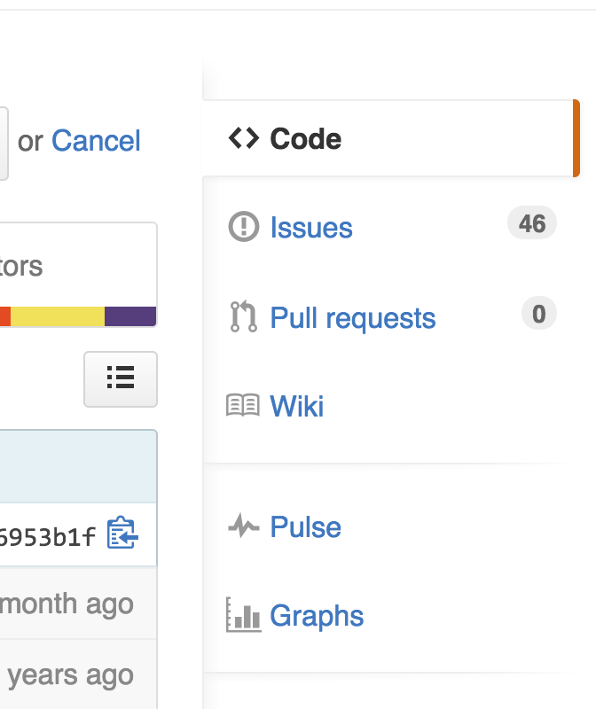
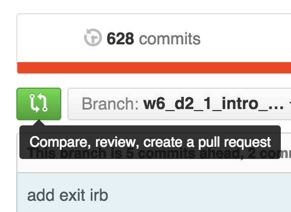

# Pull Request Project

## Basic Challenge

1. **20 min** - Go to your project 1 Github and add 1 issue to your project. Make it an issue a small addition that could be solved relatively quickly with the tools we already have - jQuery, express, etc. Be descriptive of what is wrong and how you'd like it fixed. Maybe give some rough steps you'd take to solve it.
<div style='width:300px;'></div>
2. **2 min** Next, pair up (A & B)
3. **3 min** Find another pair (so you're in groups of 4) (A & B + C & D)
> C & D follow the same instructions as for A & B
4. **10 min** Now, A & B, read C's issue they added to their project.
5. **10 min** Clone and fire up C's project on one of your computers.
6. **1 min** Make a new branch named after the issue you're solving.
```
$ git checkout -branch adding_comments
```
7. Pair and solve the issue, with frequent commits on the new branch.
7. Push the branch up to Github
```
$ git push origin adding_comments
```
8. Navigate to the repo on Github.com and submit the branch adding_comments as a pull request.
<div style='width:300px'></div>
9. C should code review and merge the pull request.

## Stretch
9. Time permitting do the same for D's issue.

By the end everyone's issue should have a pull request for it.

This evening code review the pull request and merge it into your project.
