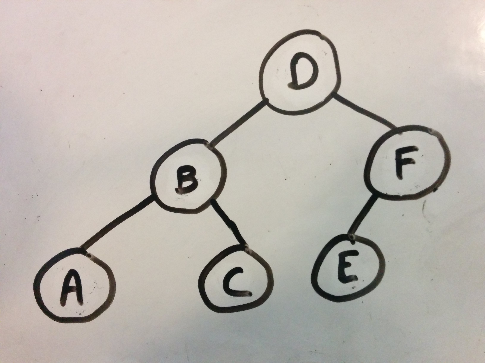
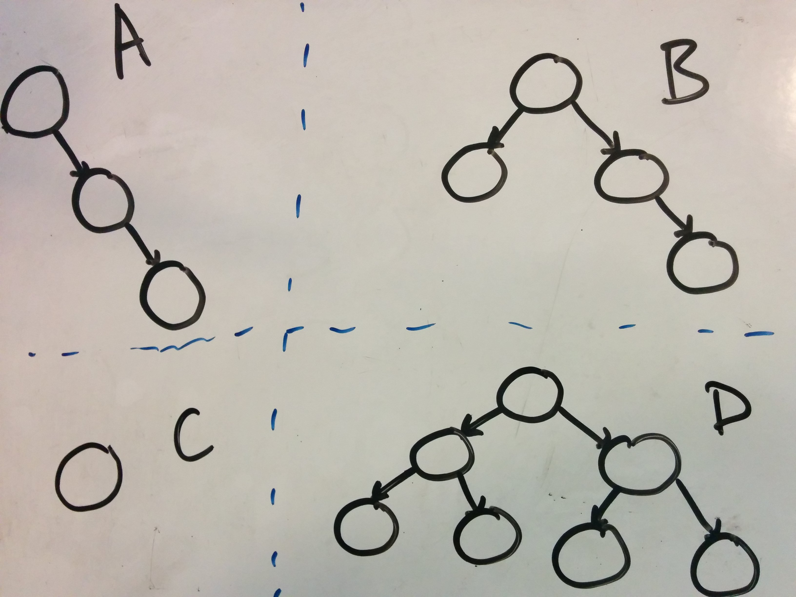

# Tree Week!

This week we'll add trees to our collection of abstract data structures.

## Graphs 

In computer science, graphs are just collections of **vertices** (also known as nodes) and **edges**. Each edge connects two vertices together.  You can think of vertices as cities on a map and think of edges as the roads between them.  Graphs are widely used in computer science and algorithms, but we today we'll focus on a particular kind of graph.

## Trees 

In computer science, trees are a kind of "directed acyclic graph".

In "directed" graphs, the edges are all like one-way roads. You can only move on an edge (called "traversing" the edge) in one direction. The word "acyclic" describes graphs without any cycles; that is, there's no cycle of edges that will lead you back to a node if you leave it. 

Trees have a few additional rules. First, every tree has a unique, special start node called the "root" node. And second, the nodes in trees can only ever have one "parent".

We usually draw trees vertically with the "root" at the top of the tree. 

Let's go into the terminology a little more with some diagrams.

## Terminology

Graphs have vertices (aka "nodes") that usually represent data, or the current "state" (configuration) of something.  Edges connect the vertices and usually represent a relationship between data objects, or a transistion from one state to another.  A sequence of edges is called a "path".

Tree data structures adopt language from family trees. If an edge in a tree connects two vertices, the source vertex is called the "parent", and the target vertex is called the "child".  From the perspective of a single node, some other nodes will be on the path between that node and the root. These are the node's "ancestors." Other nodes might be children of the  node, or children of the node's children. These are called the node's "descendants."  Nodes that share the same "parent" are known as "siblings."

Trees start with a unique "root" node at the top of the tree.  The edges in a tree are sometimes referred to as "branches".  Nodes of the tree that do not have any children are called "leaves" because no branches lead away from them. The length of the longest path from the root to a leaf is called the tree's "height".

## Trees to Know for Interviews

### Binary Trees

The most common types of trees for interviews are "binary trees," which allow each node to have up to 2 children. We say each node can have a "left child" and a "right child."  The left child can be considered the root of a "left subtree", and the right child can be considered the root of a "right subtree".

### Binary Search Trees

Binary search trees add on an extra restriction to binary trees: each node's left child subtree (if it has one) will  contain only nodes whose values are lower than the original node's value.  In each node's right child subtree (if it has one), all nodes must have a greater value than the original node itself.

### Balanced Binary Trees

Balanced binary trees are another basic variant of binary trees. A "balanced" tree has a height about as low as it can possibly be while still holding all its nodes.  For binary trees, that means the height is O(log2(n)), where n is the number of nodes in the tree.  There are different definitions of exactly how to balance a tree, but you can tell a tree is balanced if all of the leaves are either at the very bottom level of the tree or just one level higher.

### Balanced Binary Search Trees

Balanced binary search trees combine the balanced structure requirement with the node value requirement of binary search trees.  If an interview question asks about a tree, try to clarify whether the tree is balanced and whether it is a binary search tree. 

### Tries

Tries, also called prefix trees, aren't usually binary.  They allow each node to have as many children as needed. The special thing about tries is how they store data. The data builds up over the path from the root to each node.  Here's an example:

## Challenges

PLEASE DO NOT CODE UNLESS A CHALLENGE SPECIFICALLY INSTRUCTS YOU TO

Assume for the following challenges that you have a `binary_tree` data structure allowing you to:

* access the root node with `.root`.
* given any node, find the left child of that node with `.left_child`
* given any node, find the right child of that node with `.right_child`
* given any node, find the parent of that node with `.parent`

Also assume a `trie` data structure that allows you to:

* find the root with `.root`
* given any node, get a list of the node's children with `.children`
* given any node, find the node's parent with `.parent`
 
 ### Vocab Practice (skip)

1. Use the diagram below to fill in the following table:
	
	| Node  | parent | left child | right child |
	| :---- | :-- | :-- | :-- | 
	| A | | | | 
	| B | | | | 
	| C | | | |

  

1. In the same diagram (above), which node is the root?  Which are leaves?

1. Finally, in that same diagram, what is the height of the tree?
  

1. Which of the following is a tree? (There may be more than one.)

  

1. Which of the following is a balanced tree? (There may be more than one.)

  

1. Which of the following is a binary search tree? (There may be more than one.)

  

### Basic Challenges - Binary Search Trees

1. Create a binary search tree from the following array: [0,1,2,3,4,5,6].

1. Describe an algorithm to check if a particular number value is inside a binary search tree.  *Hint: start by checking if it's the value of the root.*

1. In a binary search tree, how can you find the minimum element? The maximum? 

### Basic Challenges - Tries

1. Create a trie for the following word list: ["hey", "hello", "howdy", "g'day"].

1. Add the phrase "hello, govnuh" to your trie from above.  

1. In a normal tree, the number of nodes determines the tree's minimum possible height. What determines the minimum possible height of a trie?

### Stretch Challenges

1. A "min heap" is another abstract data structure often thought of as a type of binary tree. It has an additional restriction called the "min heap property:" every node's value is less than the values of its children. What is special about the root of a min heap?  

1. How could you print out all the numbers in a binary search tree in order from least to greatest?  *Hint*: This problem is probably easiest using recursion. 

### Actual Interview Questions

<!--1. You have a series of tasks that you need to schedule. Let's say you're getting dressed, so you need to put on your: shoes, underwear, shirt, pants, and socks. Some of these things have to happen in a certain order (like socks before shoes). How can you use a tree to plan the order of your tasks?-->

1. You're tasked with setting up a quiz that adapts to the user by displaying different questions based on the percent of questions the user has gotten right so far. If the user has above 70% right so far, the next question should be slightly harder. If the user has below 70% right, the next set question should be slightly easier.  Question difficulty is rated on a scale from 1 to 10. Describe how you could use a tree to run this quiz.

1. Your job is to write a program that recognizes common words typed in on a 10-digit phone keypad (see the image below). Assume the user input comes to you as a sequence of numbers types into the phone.  Also assume you get a list of all the words you should include ahead of time. How would you structure your data?  

  

